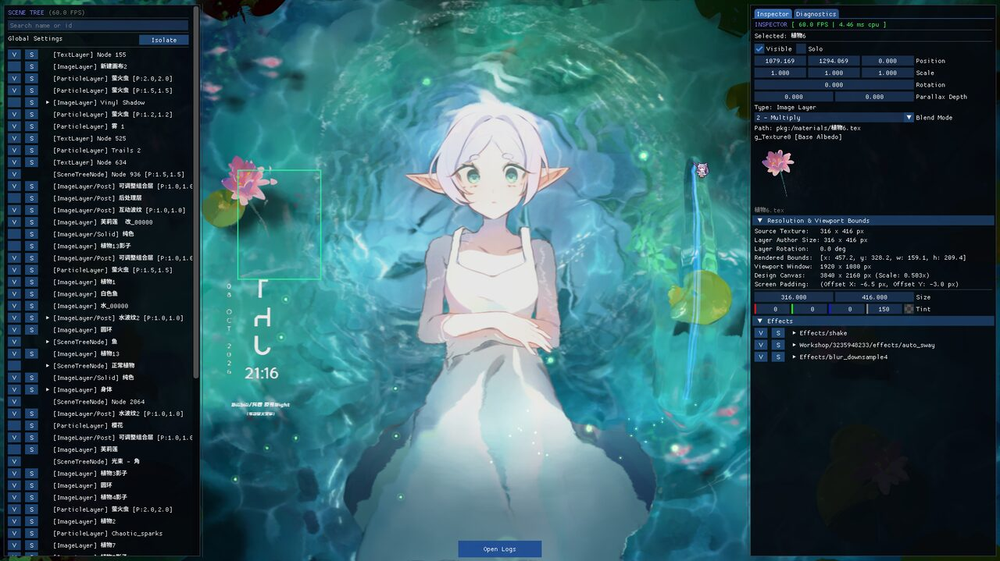
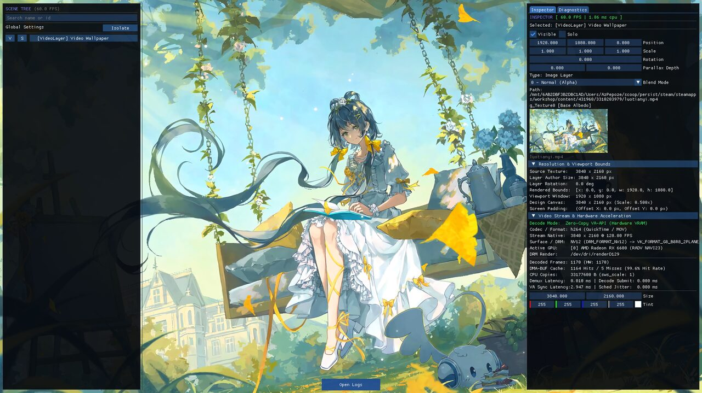
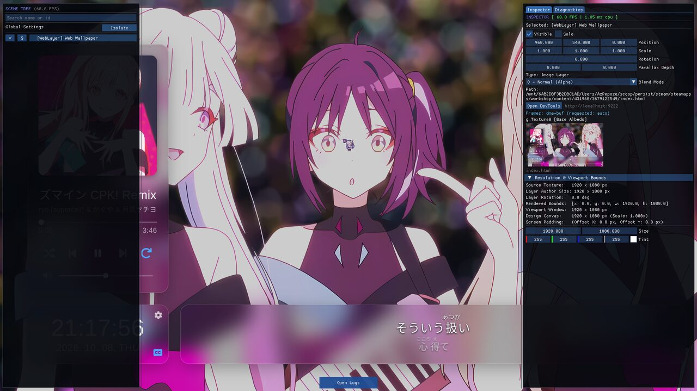
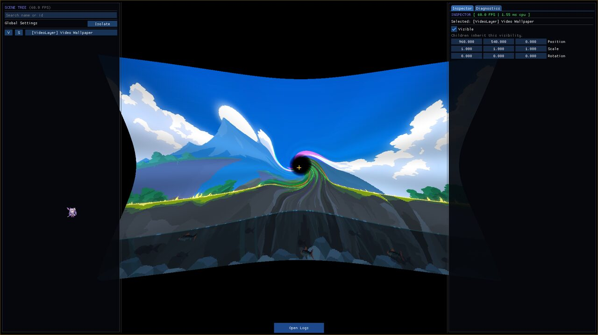
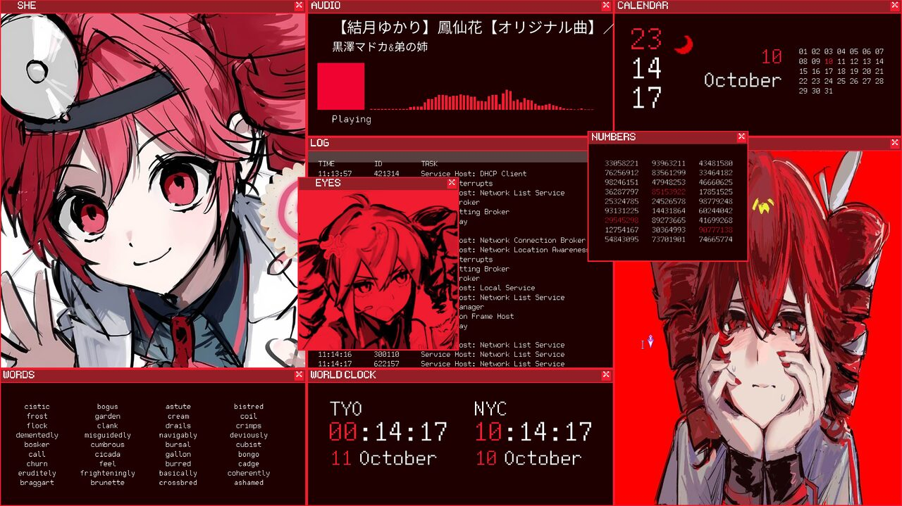

# Linux Wallpaper Engine

Shows animated wallpapers from Wallpaper Engine on Linux.

> **Beta.** There is no release yet. Install it by building from source.

> [!TIP]
> For a GUI, consider using [linux-wallpaperengine-gui](https://github.com/AzPepoze/linux-wallpaperengine-gui). It is my GUI for this project.

## What is this?

Wallpaper Engine is a program that shows animated wallpapers. People share their wallpapers as **projects**. This program plays those projects on Linux, so you do not need Windows.

> [!IMPORTANT]
> You need a Wallpaper Engine install for its assets folder. Assets are the files that the wallpapers use, such as fonts and images. Point the program to that folder with `WALLPAPER_ENGINE_PATH`, or with `engine_path` in `config.json`.

## Showcase

| Scene | Video |
| --- | --- |
|  |  |
| Web | Transition |
|  |  |
| Preset | |
|  | |

## Words used in this guide

| Word | Meaning |
| --- | --- |
| Wallpaper project | A folder with a `project.json` file, or a `.pkg` file, from Wallpaper Engine |
| Desktop background | The picture behind your windows |
| Wayland, X11 | The two main display systems on Linux |
| Optional feature | A part you can leave out. If you leave it out, only that feature is off |
| Pointer | Your mouse position |
| xmake | The tool that turns the source code into a program |

To check which display system you use, run:

```bash
echo $XDG_SESSION_TYPE
```

It prints `wayland` or `x11`.

## Quick start

| Step | What to do |
| --- | --- |
| 1 | Install and build it. Follow the [install guide](docs/install.md) |
| 2 | Run it on a wallpaper: `xmake run linux-wallpaperengine "/path/to/wallpaper"` |

Replace `/path/to/wallpaper` with the folder of the wallpaper project.

## Show a wallpaper

```bash
linux-wallpaperengine /path/to/wallpaper [OPTIONS]
```

| I want to... | Command |
| --- | --- |
| Show it in a normal window | `linux-wallpaperengine /path/to/wallpaper` |
| Use it as the desktop background on screen DP-4 | `linux-wallpaperengine /path/to/wallpaper -r DP-4 --layer bottom` |
| Play it without sound | add `-s` |
| Change a setting while it runs | add `--set-property light=0` |
| Switch to another wallpaper | run the new one. It uses the transition from `--transition` (default `fade`) |

`-r DP-4` picks the screen. Replace `DP-4` with the name of your screen:

- On X11, run `xrandr` to list the screen names.
- On Hyprland, run `hyprctl monitors`.

Stop the wallpaper with Ctrl+C in the terminal.

## Build

There are two build modes, release and debug. See [Build](docs/build.md).

## Mouse position

Some wallpapers react to the mouse. The `--pointer` option sets where the program reads the mouse position from.

`auto` (the default) tries these sources in order. It uses the first one that works:

| Order | Source | Accuracy | When it is used |
| --- | --- | --- | --- |
| 1 | X11 (`x11`) | Exact | On an X11 session. Reads the real cursor, anywhere on the desktop |
| 2 | Hyprland (`hyprland`) | Exact | On Hyprland. Reads the real cursor, anywhere on the desktop |
| 3 | Wallpaper surface (`surface`) | Exact | Only when the cursor is over the wallpaper, and no source above works |
| 4 | Mouse motion (`evdev`) | Estimate | Last resort. Follows mouse movement from `/dev/input`, and can drift |

You can also pick one source with `--pointer x11`, `--pointer hyprland`, `--pointer surface` or `--pointer evdev`. If that source does not work, the program moves down the list and logs a warning.

To let the program read the mouse movement (sources 4 and the `auto` fallback), follow the step in [Install](docs/install.md#mouse-access).

## Optional features

Each feature below needs its own libraries. Install only the ones you want.

| Feature | What it adds | Libraries it needs |
| --- | --- | --- |
| `wayland` | Desktop background on Wayland | libwayland-client, libxkbcommon |
| `x11` | Desktop window on X11 | libXrandr |
| `mpris` | Lets wallpapers read the current song (title, artist, album) from music players | libsystemd |
| Web | Web wallpapers (projects that show a web page) | Qt6 WebEngine |

## Notes

- Only Arch Linux has been tested.

## Credits

Some references come from these projects:

| Project | Link |
| --- | --- |
| linux-wallpaperengine by Almamu | [github.com/Almamu/linux-wallpaperengine](https://github.com/Almamu/linux-wallpaperengine) |
| open-wallpaper-engine by waywallen | [github.com/waywallen/open-wallpaper-engine](https://github.com/waywallen/open-wallpaper-engine) |
| linux-wallpaperengine-gui by AzPepoze | [github.com/AzPepoze/linux-wallpaperengine-gui](https://github.com/AzPepoze/linux-wallpaperengine-gui) |

## More

| I want to... | Read |
| --- | --- |
| Install the libraries and build it | [docs/install.md](docs/install.md) |
| Build modes (release and debug) | [docs/build.md](docs/build.md) |
| See every option | [docs/options.md](docs/options.md) |
| Build, test and debug the program | [docs/development.md](docs/development.md) |
| See what works and what does not | [docs/features.md](docs/features.md) |
| Compare with the upstream launcher | [docs/compatibility.md](docs/compatibility.md) |
| Learn the Wallpaper Engine file formats and behaviour | [docs/wallpaper-engine-knowledge.md](docs/wallpaper-engine-knowledge.md) |

## STONKS!

<div align="center">
  <a href="https://www.star-history.com/#AzPepoze/linux-wallpaperengine&type=date&legend=top-left">
    <picture>
      <source media="(prefers-color-scheme: dark)" srcset="https://api.star-history.com/svg?repos=AzPepoze/linux-wallpaperengine&type=date&theme=dark&legend=top-left" />
      <source media="(prefers-color-scheme: light)" srcset="https://api.star-history.com/svg?repos=AzPepoze/linux-wallpaperengine&type=date&legend=top-left" />
      
    </picture>
  </a>
  <br>
  <br>
  <strong>Made by AzPepoze</strong>
</div>
